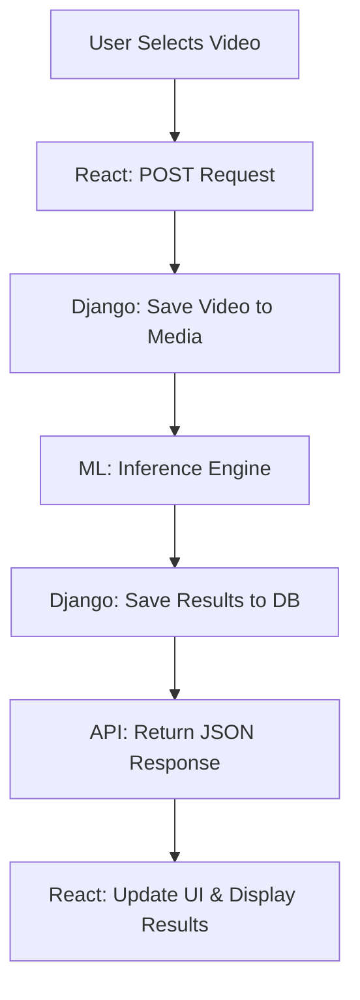

# 🎥 Cornerstone Video Moderation Project

A full-stack application designed to analyze and moderate video content using a React frontend and a Django-powered Machine Learning backend.

---

## 🏗️ Project Structure

This repository contains both the frontend and backend source code.

### 💻 Frontend (React + Vite + Tailwind v4)
```text
frontend/
├── public/              # Static assets
├── src/
│   ├── assets/          # Global images and styles
│   ├── components/      # UI Building blocks
│   │   ├── common/      # Buttons, Inputs, Loaders
│   │   ├── upload/      # Video upload logic
│   │   ├── results/     # Analysis display
│   │   ├── video/       # Video player components
│   │   └── layout/      # Navbar and Footer
│   ├── pages/           # Home & Analyze views
│   ├── services/        # API calls (Django integration)
│   ├── hooks/           # Custom hooks (useVideoAnalysis)
│   ├── utils/           # Helpers (formatTime)
│   ├── App.jsx          # Main Routing
│   └── main.jsx         # Entry point
└── package.json         # Dependencies
```

### ⚙️ Backend (Django + REST Framework)
```text
backend/
├── manage.py            # Django CLI tool
├── requirements.txt     # Python dependencies
├── config/              # Project settings and routing
├── moderation/          # Main application logic
│   ├── models.py        # Database schema for videos/results
│   ├── views.py         # API endpoints
│   ├── serializers.py   # Data transformation logic
│   ├── ml/              # Machine Learning integration
│   │   ├── model.py     # ML Model architecture
│   │   └── inference.py # Prediction logic
│   └── tasks.py         # Background processing tasks
└── media/               # User-uploaded content (Ignored by Git)
```

### 🚀 System Architecture & Flow
The following diagram represents the end-to-end data flow when a user interacts with the platform:


## ✨ Key Features

- **Real-time Video Upload:** Drag-and-drop interface for seamless video submission.
- **AI-Powered Analysis:** Backend integration with Machine Learning models for content moderation.
- **Detailed Reporting:** Visual breakdown of moderation results (JSON to UI mapping).
- **Responsive Design:** Fully optimized for mobile and desktop using Tailwind CSS v4.

---

## 🛠️ Getting Started

### Prerequisites
* **Node.js** (v18 or higher)
* **Python** (v3.9 or higher)

### 1. Frontend Setup
```bash
cd frontend
npm install
npm run dev
```

### 2. Backend Setup
```bash
# Navigate to the backend folder
cd backend

# Create a virtual environment
python -m venv venv

# Activate the environment:
# Windows:
venv\Scripts\activate
# Mac/Linux:
source venv/bin/activate

# Install requirements
pip install -r requirements.txt

# Run migrations and start server
python manage.py migrate
python manage.py runserver
```
